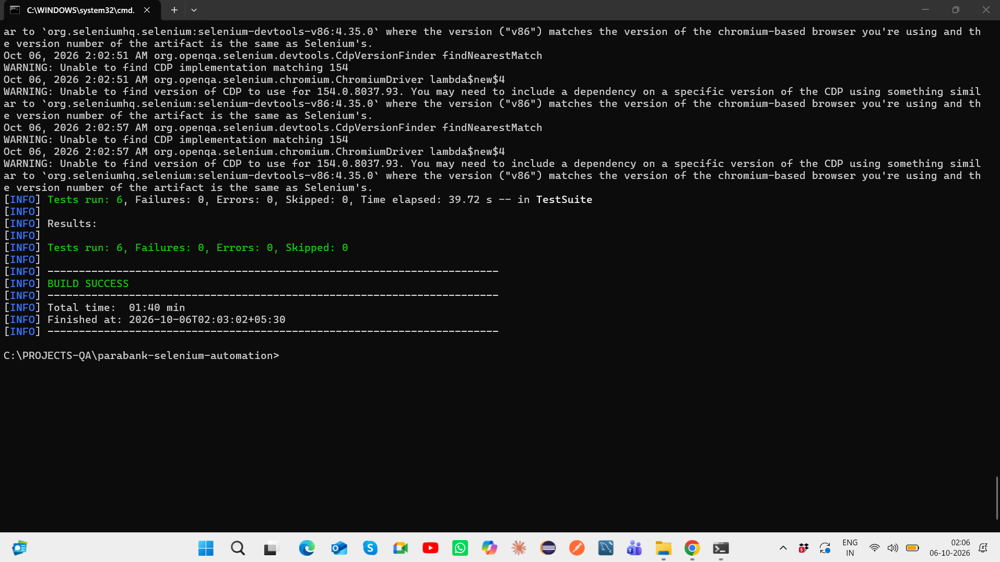
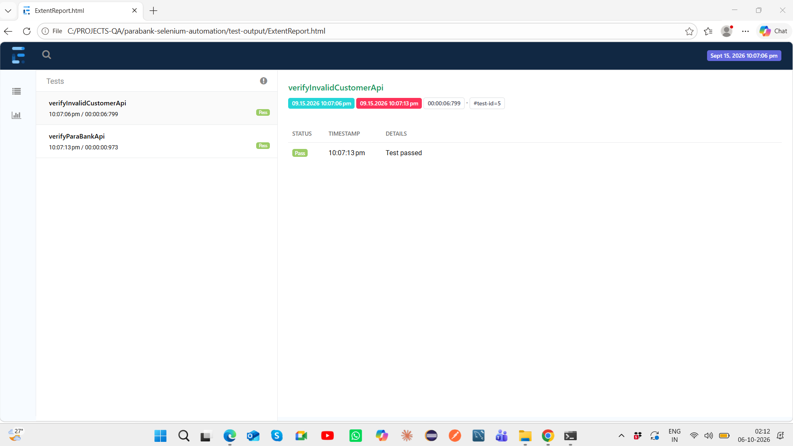
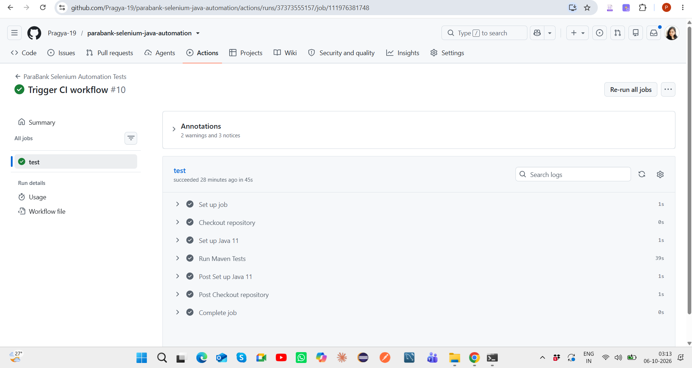

# ParaBank Selenium Java Automation Framework

[](https://github.com/Pragya-19/parabank-selenium-java-automation/actions/workflows/test.yml)

End-to-end QA automation framework built using **Selenium WebDriver, Java, TestNG, Maven, REST Assured, Page Object Model, Extent Reports, and GitHub Actions CI/CD**.

The project demonstrates both **UI automation and API validation** against the ParaBank banking application.

---

## Project Objective

The objective of this project is to demonstrate a maintainable automation framework covering both browser-based and API-level validation.

The framework focuses on:

- Selenium WebDriver UI automation
- Page Object Model
- TestNG test execution
- Data-driven negative testing
- REST Assured API validation
- positive and negative scenarios
- reusable utilities
- Extent reporting
- Maven execution
- GitHub Actions CI/CD

---

## Tech Stack

- Java
- Selenium WebDriver
- TestNG
- Maven
- REST Assured
- Page Object Model
- Extent Reports
- Git
- GitHub
- GitHub Actions
- Chrome / ChromeDriver

---

## Framework Architecture

```text
                   TestNG Test Suite
                          |
              -------------------------
              |                       |
         UI Automation            API Automation
              |                       |
      Selenium WebDriver           REST Assured
              |                       |
       Page Object Model         API Assertions
              |                       |
      Browser Validation       Response Validation
              |                       |
              ----------- -------------
                          |
                    Test Results
                          |
                   Extent Reports
                          |
                  GitHub Actions CI
```

---

## Project Structure

```text
parabank-selenium-java-automation
│
├── .github/
│   └── workflows/
│       └── test.yml
│
├── docs/
│   └── screenshots/
│       ├── selenium-maven-6-tests-passed.png
│       ├── extent-report-current-suite.png
│       └── github-actions-selenium-ci-passed.png
│
├── src/
│   ├── main/
│   │   └── java/
│   │
│   └── test/
│       └── java/
│           └── com/
│               └── pragya/
│                   └── banking/
│                       ├── api/
│                       │   └── BankingApiTest.java
│                       │
│                       ├── pages/
│                       │
│                       ├── tests/
│                       │   └── BankingTest.java
│                       │
│                       └── utilities/
│
├── test-output/
├── pom.xml
├── testng.xml
└── README.md
```

---

## Current Stable Execution

The current default Maven/TestNG suite executes successfully with:

- **6 automated tests**
- **6 passed**
- **0 failures**
- **0 errors**
- **0 skipped**
- **Maven BUILD SUCCESS**

The default suite is intentionally kept stable for repeatable local and CI execution.

---

## UI Automation Coverage

The Selenium WebDriver layer covers:

- successful login
- invalid login validation
- multiple negative login combinations using TestNG DataProvider
- page navigation
- account-related UI validation
- reusable browser interactions through Page Object Model

The framework also contains a fund-transfer UI scenario, but it is currently excluded from the stable default suite because the public ParaBank environment can be inconsistent for account-dependent transfer workflows.

---

## API Automation Coverage

REST Assured is used for API-level validation.

Current stable coverage includes:

- successful customer API request
- HTTP status code validation
- XML response-body validation
- content-type validation
- response-time validation
- negative customer lookup validation
- REST API assertions

A fund-transfer API scenario is also retained in the framework but excluded from the default stable suite because it depends on public demo-environment account state.

---

## Page Object Model

The framework follows the **Page Object Model (POM)** design pattern.

```text
Test Class
    |
    v
Page Object
    |
    v
Locators + Reusable Methods
    |
    v
Selenium WebDriver
    |
    v
ParaBank Application
```

This provides:

- separation of test logic and UI interaction
- reusable locators
- easier maintenance
- improved readability
- reduced duplication

---

## Data-Driven Testing

Negative login scenarios use **TestNG DataProvider** to execute multiple credential combinations using the same reusable test logic.

Example concept:

```text
Username       Password
---------      -------------
invalidUser    invalidPass
john           wrongPassword
wrongUser      demo
```

This allows broader validation without duplicating test methods.

---

## API Validation

REST Assured tests validate properties such as:

```text
HTTP Status Code
Response Body
Content Type
Response Time
Positive Response
Negative Response
```

The API layer complements UI testing by validating application behavior directly at service level.

---

## Running the Project

### Prerequisites

- Java
- Maven
- Chrome
- Git

Verify Java:

```bash
java -version
```

Verify Maven:

```bash
mvn -version
```

---

### Run the complete stable suite

```bash
mvn clean test
```

Expected result:

```text
Tests run: 6
Failures: 0
Errors: 0
Skipped: 0

BUILD SUCCESS
```

---

## TestNG

TestNG is used for:

- test execution
- annotations
- assertions
- DataProvider
- suite management
- listeners
- reporting integration

The suite can be managed using:

```text
testng.xml
```

---

## Extent Reports

The framework integrates **Extent Reports** to provide readable HTML execution results.

The report provides:

- individual test results
- pass/fail status
- timestamps
- execution details
- test-level reporting

After test execution, the report is available under:

```text
test-output/ExtentReport.html
```

---

## Execution Evidence

### Maven / TestNG Execution

The latest stable suite executes all 6 enabled tests successfully.



---

### Extent Report

Extent Reports provide readable HTML reporting for the automation suite.



---

### GitHub Actions CI

The project is also executed through GitHub Actions in a clean CI environment.



---

## CI/CD Workflow

```text
Code Push / Pull Request
          |
          v
GitHub Actions
          |
          v
Ubuntu Runner
          |
          v
Java Setup
          |
          v
Maven Dependency Resolution
          |
          v
mvn clean test
          |
          v
TestNG Execution
          |
          +------------------+
          |                  |
          v                  v
 Selenium UI Tests     REST Assured API Tests
          |                  |
          +---------+--------+
                    |
                    v
              Test Results
```

---

## Stable Suite Strategy

Two fund-transfer scenarios are retained in the framework but excluded from the current default execution.

This is intentional.

Because ParaBank is a public demo application, account-dependent transfer flows can occasionally be affected by shared environment state.

For the default quality gate, the project prioritizes:

```text
Repeatability
    +
Deterministic execution
    +
Stable assertions
    +
Reliable CI
```

over artificially increasing the test count.

---

## Reporting and Debugging

The framework includes:

- TestNG execution output
- Extent HTML reporting
- reusable screenshot support
- positive and negative assertions
- API response logging
- Maven build results
- CI execution evidence

---

## Key Concepts Demonstrated

- Selenium WebDriver
- Java
- TestNG
- Maven
- Page Object Model
- Data-driven testing
- REST Assured
- API automation
- positive testing
- negative testing
- HTTP response validation
- XML response validation
- Extent Reports
- Git version control
- GitHub Actions CI/CD
- UI and API automation in one framework
- stable test-suite design

---

## Key Learning

This project demonstrates how UI and API automation can coexist within a single QA framework.

The overall approach combines:

```text
UI Automation
      +
API Validation
      +
Reusable Framework Design
      +
Data-Driven Testing
      +
Reporting
      +
CI/CD
```

to create a repeatable automation workflow.

The project also demonstrates an important QA engineering principle:

> A smaller deterministic suite is more valuable as a CI quality gate than a larger suite containing unstable environment-dependent tests.
